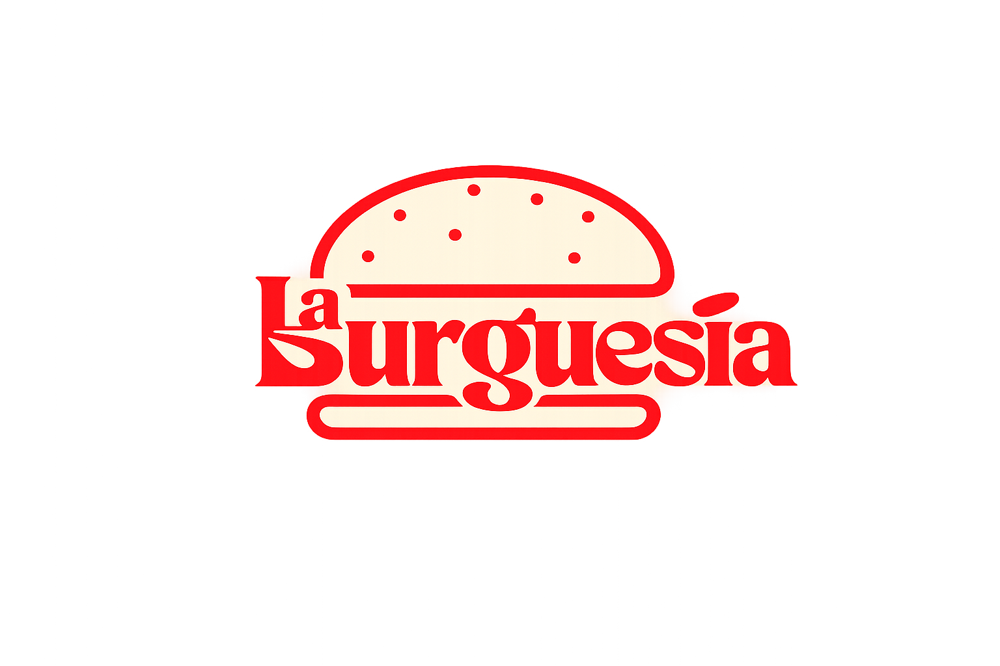

# 🍔 La Burguesía — Hamburguesería Gourmet

<p align="center">
  
</p>

---

## 🏛️ Contexto Académico
* **Institución:** Universidad Nacional del Nordeste (UNNE)
* **Facultad:** Facultad de Ciencias Exactas y Naturales y Agrimensura (FACENA)
* **Carrera:** Licenciatura en Sistemas de Información
* **Materia:** Taller de Programación I (3er Año)
* **Año Académico:** 2026

### 👥 Integrantes del Proyecto
* 👨‍💻 **Fernández, Alejandro Facundo**
* 👩‍💻 **Barrios, Guadalupe Aymara**

---

## 📝 Descripción del Proyecto
**La Burguesía** es una plataforma web completa de comercio electrónico y gestión administrativa diseñada específicamente para una hamburguesería gourmet. Combina una interfaz pública moderna y fluida para que los clientes exploren el menú y realicen compras, con un potente panel de administración privado (Dashboard) para gestionar el inventario, los usuarios, el catálogo de productos, las categorías y responder de forma directa a las consultas de los clientes mediante correo electrónico.

---

## 🚀 Características Principales

### 🛒 Portal del Cliente (Frontend)
* **Página de Inicio Dinámica:** Carrusel interactivo que muestra productos con imágenes reales de forma aleatoria y una sección de destacados.
* **Catálogo de Menú Interactivo:** Filtrado en tiempo real por categorías activas, actualización dinámica del stock y control de unidades disponibles.
* **Carrito de Compras Offcanvas (Bootstrap):** Sincronización local en tiempo real (`localStorage`), permitiendo agregar productos, cambiar cantidades y calcular totales al instante.
* **Flujo de Checkout Personalizado:** Formulario para concretar la compra donde el usuario indica:
  * **Método de entrega:** *Take Away* o *Envío a domicilio* (aplicando un recargo automático de $1.000 por envío).
  * **Forma de pago:** Efectivo, Tarjeta de Crédito/Débito o Transferencia Bancaria.
  * **Dirección de envío:** Validación condicional según la entrega seleccionada.
* **Perfil de Usuario:** Panel personal del cliente con su información y un historial de compras estético en formato de acordeones desplegables detallando cada pedido.
* **Formulario de Contacto Inteligente:** Para usuarios autenticados autocompleta el nombre y correo electrónico bloqueando su edición (`disabled`) para evitar fraudes, enviando además un correo automático de confirmación.

### 🛡️ Panel de Administración (Backend/Dashboard)
* **Control de Accesos y Permisos:** Restricciones estrictas por roles (Admins/Clientes). Los administradores tienen deshabilitado el flujo de compras y botones del carrito en toda la app.
* **Gestión de Usuarios:** Listado de cuentas registradas con prioridad visual para administradores y posibilidad de activar o desactivar usuarios de forma lógica.
* **Gestión de Productos (CRUD):** 
  * Cargar productos con imagen, precio, stock y categoría.
  * Marcar productos como destacados con un solo clic (sistema de estrellas).
  * Activación/Desactivación lógica (en lugar de eliminaciones físicas que rompan el historial de ventas).
* **Gestión de Categorías (CRUD):**
  * Activación/Desactivación lógica de categorías.
  * Ocultamiento inteligente: al desactivar una categoría, esta desaparece del catálogo y todos sus productos se ocultan automáticamente del catálogo y del inicio para evitar compras de productos no ofertados.
* **Centro de Respuestas a Consultas:** El administrador puede visualizar los mensajes recibidos y **responderlos directamente desde el Dashboard**. Esto genera un correo electrónico HTML formal enviado al cliente (vía SMTP/Mailtrap) y registra la respuesta en la base de datos para futuras consultas de auditoría.

---

## 🛠️ Tecnologías Utilizadas

* **Framework Principal:** [Laravel 11](https://laravel.com/)
* **Lenguaje:** PHP 8.2+ & JavaScript ES6 (Vanilla)
* **Base de Datos:** MariaDB / MySQL
* **Diseño y Estilos:** Bootstrap 5, Vanilla CSS & Bootstrap Icons
* **Pruebas de Correo:** Mailtrap (Entorno de desarrollo SMTP seguro)

---

## ⚙️ Instrucciones de Instalación y Configuración

Sigue estos pasos para clonar y ejecutar el proyecto en tu entorno local:

### 1. Clonar el repositorio e Instalar dependencias
```bash
git clone https://github.com/facundofernanddez/LaBurguesia
cd LaBurguesia
composer install
npm install
```

### 2. Configurar el archivo de entorno `.env`
Duplica el archivo de ejemplo `.env.example` y renómbralo a `.env`:
```bash
cp .env.example .env
```
Genera la clave de aplicación:
```bash
php artisan key:generate
```

### 3. Configurar Base de Datos en el `.env`
Edita las variables de conexión de base de datos según tu servidor local:
```env
DB_CONNECTION=mariadb
DB_HOST=127.0.0.1
DB_PORT=3306
DB_DATABASE=laburguesia_barrios_fernandez
DB_USERNAME=root
DB_PASSWORD=root
```

### 4. Configurar Mailtrap para el envío de correos
Para probar la confirmación de consultas y la funcionalidad de responder consultas de administrador, ingresa tus credenciales de Mailtrap SMTP en el archivo `.env`:
```env
MAIL_MAILER=smtp
MAIL_HOST=sandbox.smtp.mailtrap.io
MAIL_PORT=2525
MAIL_USERNAME=8d7eb99252ddd0
MAIL_PASSWORD=1074576514a647
MAIL_ENCRYPTION=tls
MAIL_FROM_ADDRESS="no-reply@laburguesia.com"
MAIL_FROM_NAME="La Burguesía"
```

### 5. Ejecutar Migraciones y Seeds
Crea las tablas y siembra los registros obligatorios, las categorías y los 28 productos iniciales en tu base de datos:
```bash
php artisan migrate --seed
```
*(Si ya tenías creadas las tablas anteriormente y solo deseas cargar o actualizar las categorías y productos, puedes ejecutar únicamente el seeder):*
```bash
php artisan db:seed
```

### 6. Levantar Servidores locales
Inicia el servidor de desarrollo de Laravel:
```bash
php artisan serve
```
Y si es necesario, compila los recursos Frontend para desarrollo:
```bash
npm run dev
```

El sistema estará accesible en tu navegador en: [http://127.0.0.1:8000](http://127.0.0.1:8000)

---

## 📂 Estructura Principal del Proyecto
* **`app/Http/Controllers/`:** Controladores que contienen la lógica empresarial (`AdminController`, `AdminCategoriaController`, `AdminProductoController`, `ClienteController`, `ContactoController`, `AuthController`).
* **`app/Mail/`:** Clases Mailables encargadas de estructurar los envíos de correos electrónicos (`ConsultaRecibida`, `RespuestaConsulta`).
* **`resources/views/`:** VistasBlade organizadas por componentes reutilizables, correos HTML (`emails/`), panel de administración (`backend/admin/`), y páginas públicas (`frontend/`).
* **`database/migrations/`:** Historial de migraciones para la generación estructurada de la base de datos.
* **`public/css/styles.css`:** Hojas de estilos del proyecto.

---

<p align="center" style="margin-top: 30px;">
  Trabajo práctico desarrollado para la cátedra <b>Taller de Programación I</b>.<br>
  <b>Licenciatura en Sistemas de Información - UNNE</b>
</p>
